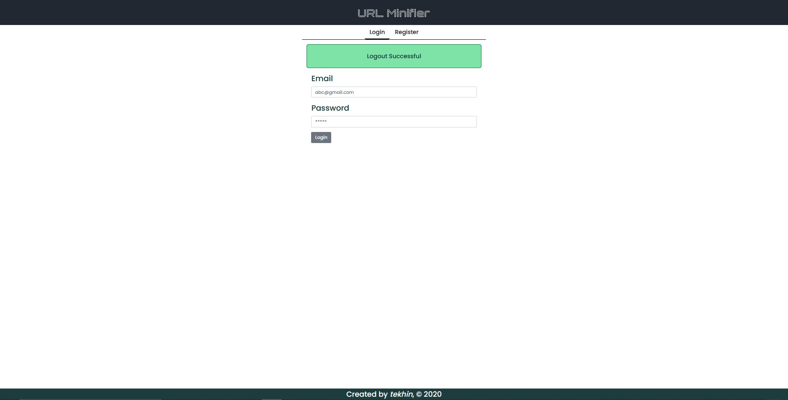
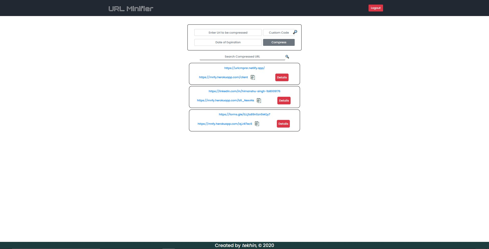
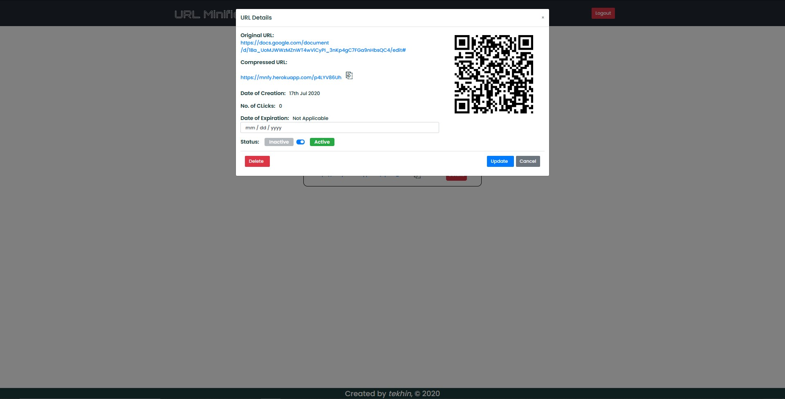

# **URL Minifier App ✂️ 💻 👈**

 

 

This is the [URL Minifier App](https://urlcmprsr.netlify.app/)

An App to manage `minified URLs` and `generate QR Codes` of the minified URLs.

 

[Click for Client Repo](https://github.com/HyperLoo/UrlCompressor-Client)

## **Login Section 🔑**

Here you can `Register` or `Login` to the App.  
_[ Uses JSON Web Token based Authentication.
Click [here](https://jwt.io/introduction/) to read more ]_  

## **Compress URL Section 🏷️**

Here one can create a new `Compressed URL` with it's `Expiration Date` if needed or `No Expiration` by default.

Also, one can see all the `compressed URLs` by him with the `Original URLs` and can copy it for sharing.

  

## **URL Details and Update Section 📝**

One can see all the details about to the given compressed URL.

- The `state` _(active/inactive)_ can be switched here.
- Once can extend `Deadline` of the URL.
- `No. of Clicks` on the particular URL can be monitored here.
- One can also open url using `QR Code` for the compressed url.
- The Compressed URLs can be `Updated` as well as `Deleted` from here.
